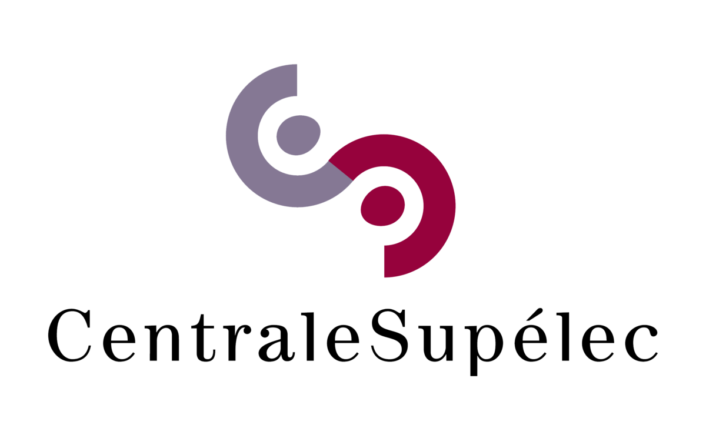
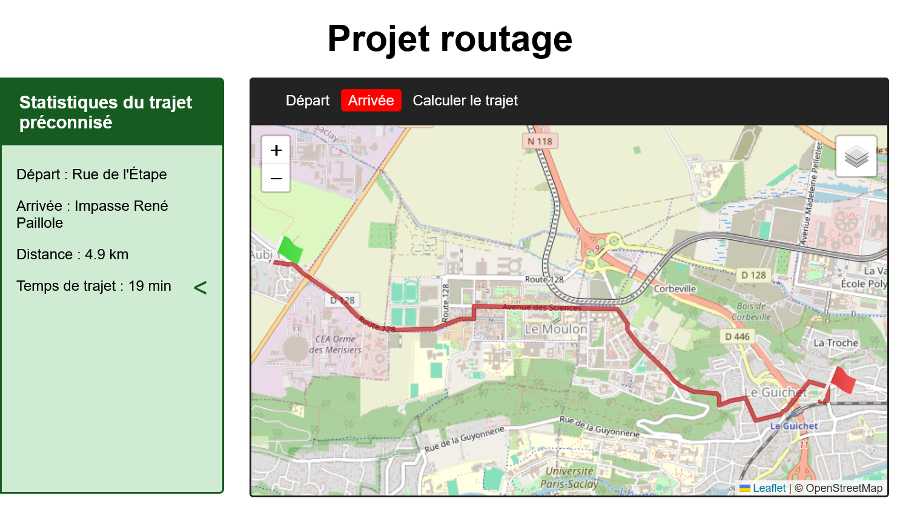

<div id="top"></div>


<!-- PROJECT SHIELDS -->
<!--
*** I'm using markdown "reference style" links for readability.
*** Reference links are enclosed in brackets [ ] instead of parentheses ( ).
*** for contributors-url, forks-url, etc. This is an optional, concise syntax you may use.
*** https://www.markdownguide.org/basic-syntax/#reference-style-links
-->


<!-- PROJECT LOGO -->
<br />
<div align="center">
  <a href="https://www.centralesupelec.fr/">
    
  </a>

<h3 align="center"><b><font size="+9">DATA SCIENCE</font></h3>
<h3 align="center"><b><font size="+10">- ROUTAGE -</font></h3>


  <p align="center"><p><font size="+2">
  This is a project that analyzes the routing of a cyclist. By providing the itenerary, the user/cyclist can have an analysis on his individual physical performance regarding this route. The analysis can give some information about the type of the route and the conditions of the route the user selected to follow. Futhermore, the analysis constists of the total distance, the velocity, the gradients and the future prediction of the time. By an elaborate automatic learning of travel times and regression models, it can provide more accurate information on the key elements of routing. </font></h3>


<div align="left">
<!-- TABLE OF CONTENTS -->
<details>
  <summary>Table of Contents</summary>
  <ol>
    <li>
      <a href="#about-the-project">About The Project</a>
      </li>
    <li>
      <a href="#getting-started">Getting Started</a>
      <ul>
        <li><a href="#prerequisites">Prerequisites</a></li>
        <li><a href="#modules">Overview of the modules</a></li>
      </ul>
    </li>
    <li><a href="#usage">Usage</a></li>
    <li><a href="#contributing">Contributing</a></li>
    <li><a href="#license">License</a></li>
    <li><a href="#contact">Contact</a></li>
    <li><a href="#acknowledgments">Acknowledgments</a></li>
  </ol>
</details>

<!-- ABOUT THE PROJECT -->

<div id="about-the-project"></div>

## About The Project

This project was carried out at CentraleSupélec as part of the Data Science department during the years 2023 and 2024, building upon previous work. The project aims to provide a cycling routing recommendation that fits the user's physical performance.

The project is divided in three main parts:
1. the data collection and the data processing
2. the data analysis and modeling
3. the user interface

<div align=center></div>
</br>

In the third part, the user can interact with the previous interface, the main tasks the app can perform are the following:

- Select the start and end points of the route
- Calculate the optimal route between the two points
- Display some statistics about the route
  - Total distance
  - Total elevation gain
  - Total elevation loss
  - Estimated time of travel


<p align="center"><font size="-1">↑ <a href="#top">back to top</a> ↑</font></p>


<!-- GETTING STARTED -->
<div id="getting-started"></div>

## Getting Started

To get to use the app, you can either download the repository or clone it. The following instructions will get you a copy of the project up and running on your local machine for development and testing purposes.

<div id="prerequisites"></div>

### Prerequisites

1. Clone the repo
   ```sh
   git clone <repository-address>
   ```

2. Install the required libraries:

Use the following intallation method: 
  ```sh
  pip install -r requirements.txt
  ```

<div id="modules"></div>

### Overview of the modules

The global organization of the project is the following:

```sh
/cycling-routing
├── /data
├── /pre-processing
├── /analysis
├── /routing-app
├── requirements.txt
├── LICENCE.txt
└── README.md
```

The `data` directory contains the data used in the project. The `pre-processing` directory contains the scripts used to process the data. The `analysis` directory contains the scripts used to analyze the data. The `routing-app` directory contains the scripts used to build the user interface.


<p align="center"><font size="-1">↑ <a href="#top">back to top</a> ↑</font></p>


<!-- USAGE EXAMPLES -->

<div id="usage"></div>

## Usage

The data used in this project are related to a specific user. Nonetheless, by replacing the GPX files in the `./data/GPX/originals/` folder, you can then run the scripts from `./pre-processing` folder, then `./analysis` folder to get the results for your own physical performance. The results will be displayed in the user interface, which is located in the `./routing-app` folder.

To get more information about the scripts and the files, please refer to the documentation of each script/file.

<p align="center"><font size="-1">↑ <a href="#top">back to top</a> ↑</font></p>

<!-- CONTRIBUTING -->
<div id="contributing"></div>

## Contributing

  Any external contribution or suggestion is  welcome and **greatly appreciated**.

If of suggestions that would make our project better and more functional, please fork the repo and create a pull request.

1. Fork the Project
2. Create your Feature Branch (`git checkout -b feature/NewFeature`)
3. Commit your Changes (`git commit -m 'Adding some New Feature'`)
4. Push to the Branch (`git push origin feature/NewFeature`)
5. Open a Pull Request


<p align="center"><font size="-1">↑ <a href="#top">back to top</a> ↑</font></p>


<!-- LICENSE -->
<div id="license"></div>

## License

Distributed under the MIT License.

See [LICENCE.txt](LICENCE.txt) for more information.


<p align="center"><font size="-1">↑ <a href="#top">back to top</a> ↑</font></p>


<!-- CONTACT -->
<div id="contact"></div>

## Contact

Contributors/Creators:

* Daniel Bach - CentraleSupélec - daniel.bach@student-cs.fr

* Thomas Desfontaine - CentraleSupélec - thomas.desfontaine@student-cs.fr

* Alexandre Faure - CentraleSupélec - alexandre.faure@student-cs.fr

* Gaston Huber - CentraleSupélec - gaston.huber@student-cs.fr


<p align="center"><font size="-1">↑ <a href="#top">back to top</a> ↑</font></p>


<!-- ACKNOWLEDGMENTS -->
<div id="acknowledgments"></div>

## Acknowledgments
We would like to thank professors José Picheral and Emmanuel Vazquez for their advice and help throughout this project. Their guidance was helpful in finalizing our project.

<p align="center"><font size="-1">↑ <a href="#top">back to top</a> ↑</font></p>

</div>
